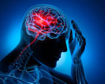

# SC1015-mini-project

## About

This is a Mini-Project for SC1015 (Intro To Data Science and Artificial Intelligence) which uses the datasets from Kaggle to analyse how having stroke can be affected by different predictors and to find a set of predictors that can be used to predict stroke. We did data preparation and cleaning, data visualization and analysis as well as machine learning.

### 1. Data Preparation and Cleaning
- initial data exploration to prepare for cleaning
- extraction, preparation and cleaning of data

### 2. Data Visualisation and Analysis
- visualisation of differences in trends and distribution between stroke and other variables
- exploratory analysis and visualisation of all features over time
- visualisation and analysis of relationships between all metrics against stroke

### 3. Machine Learning
- making use of Naive Bayes to choose the variables that predicts stroke most accurately
- training and evaluation of decision trees and random forest models to predict stroke
- analysis of coefficients and importances of various features in different models

## Contributors

|  Name  |  Area of Focus  |  GitHub Account  |
|  ---  |  ---  | --- |
|  Suki Ng  |  Data Preparation, Data Visualisation, Machine Learning, Presentation, Github Respository  |
|  Issac Lim  |  Data Preparation, Data Cleaning, Data Visualisation, Presentation, Github Respository  |
|  Tay Shu Shuang  |  Data Preparation, Data Visualisation, Machine Learning, Presentation, Github Respository  |

## Problem Definition
According to the World Health Organization (WHO) stroke is the 2nd leading cause of death globally, responsible for approximately 11% of total deaths.
We want to use data science and ML to predict the occurrence of stroke for early detection and treatment. According to research, if stroke is detected or diagnosed early, the loss of death and severe damage to brain can be prevented in 85% cases

## Models Used

- Chi-Square Test
- Naive Bayes
- Decision Tree
- Random Forest Regression

## What we learned from this project
- We learnt how to make use of Chi-Square Test and Naive Bayes to select variables that can help us predict stroke
- We learnt how to use Random Forest Regression to plot a more accurate decision tree to help us predict stroke
- We learnt how to use Synthetic Minority Oversampling Technique (SMOTE) to oversample the data of people with stroke so that our dataset will be more balanced.
- 
## Conclusion

## Datasets used
https://www.kaggle.com/datasets/fedesoriano/stroke-prediction-dataset

## References

https://www.kaggle.com/code/neereshkumar/stroke-prediction-data-analysis/notebook#Rare-Labels
https://www.kaggle.com/code/marwanyasser/stroke-prediction
https://www.kaggle.com/code/olukayodeifeoluwapo/stroke-analysis
https://www.kaggle.com/code/monkeyhaha/stroke-prediction-eda-model-selectio
https://www.ncbi.nlm.nih.gov/pmc/articles/PMC9017592/

